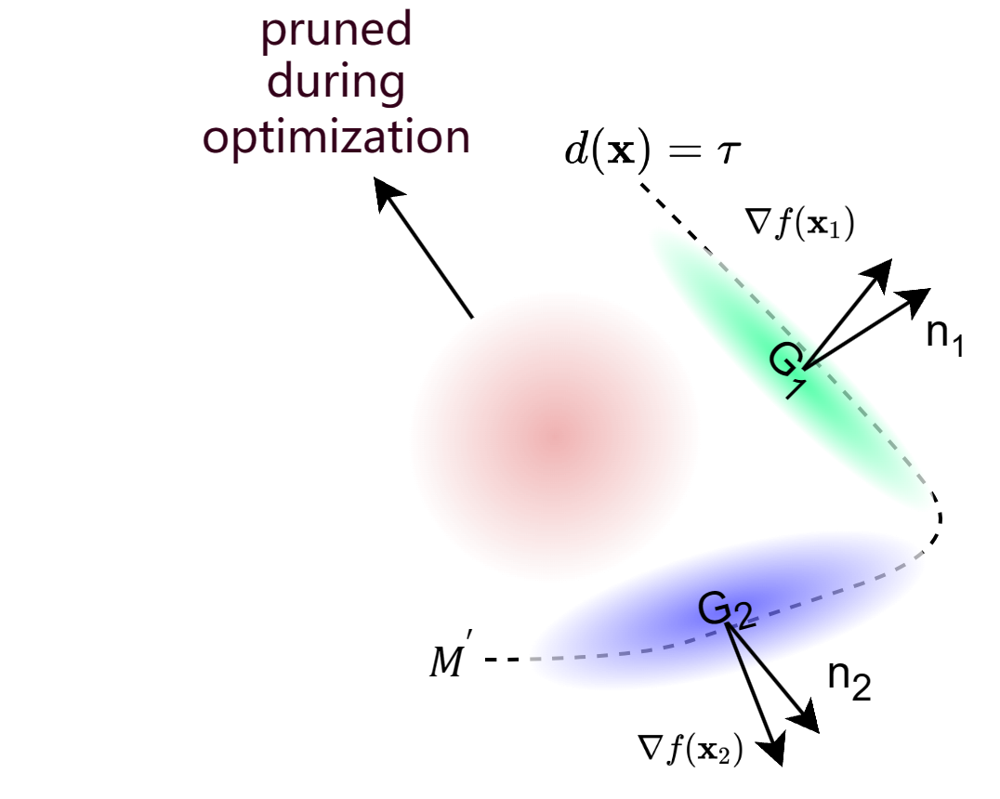
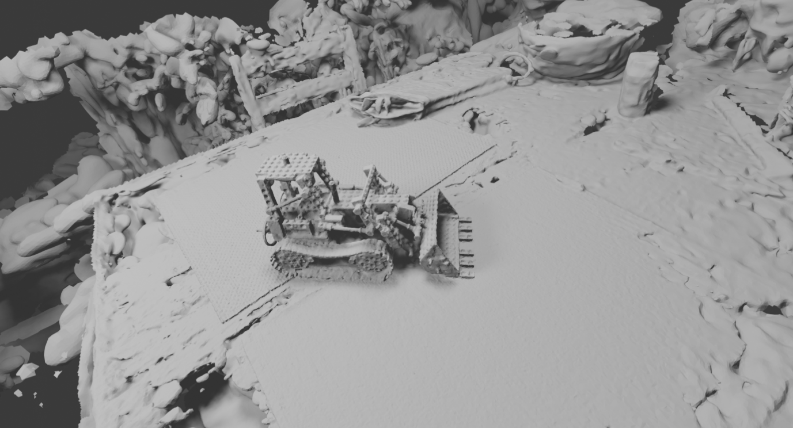

# SuGaRL1

## Abstract

We propose a method to accelerate the extraction of meshes from 3D Gaussian Splatting. After Neural Radiance Fields demonstrated amazing results, 3D Gaussian Splatting has achieved significantly faster speeds and high-quality rendering of novel views. However, extracting a high-quality mesh from millions of tiny 3D Gaussians remains challenging. Surface-Aligned Gaussian Splatting (SuGaR) introduces regularization to distribute Gaussians on object surfaces and extract surface meshes, but it faces issues of slow extraction and messy result. Our contribution includes introducing an L1 regularization term and a pruning strategy for opacity during 3D Gaussian Splatting training, reducing unnecessary Gaussians and obtaining a higher quality reconstruction initialization. We also introduce L1 regularization in SuGaR to encourage Gaussians to adhere closely to surfaces while retaining detail, and apply Poisson Reconstruction for mesh extraction. Additionally, we provide an optional refinement strategy that binds Gaussians to the surface mesh, further optimizing model details. Our method retrieves high-quality, editable rendered meshes within minutes, surpassing the original in quality while reducing training time.


## Overview

Our method begin with training a 3DGS model, here is the rough pipeline of the forward propagation in 3DGS:


Then we add L1 regularization term and Entropy Loss to the objective function in 3DGS to prune the unnesassery Gaussian:



Finally, we can run the Poisson Reconstruction on the level set and obtain the mesh object:



Here is the results from the SuGaR viewer:


## Installation

Our code is mainly build on [SuGaR](https://github.com/Anttwo/SuGaR.git) and 3[D Gaussian Splatting](https://github.com/graphdeco-inria/gaussian-splatting), so if you have already install the environment of them, you can just skip the following schedule. Or when you have issues please refer to the [SuGaR](https://github.com/Anttwo/SuGaR.git) and [3DGS](https://github.com/graphdeco-inria/gaussian-splatting) repository for more details.

### Requirements

The software requirements are the following:

1. Conda (recommended for easy setup)

2. C++ Compiler for PyTorch extensions

3. CUDA toolkit 11.8 for PyTorch extensions

4. C++ Compiler and CUDA SDK must be compatible

Hardware requirements: at least **24 GB** of GPU VRAM.

### Clone our repository

```sh
# HTTPS
git clone https://github.com/Boreas-OuO/SuGaRL1.git --recursive
```

or

```sh
# SSH
git clone git@github.com:Boreas-OuO/SuGaRL1.git --recursive
```

### Install Python packages

```sh
conda env create -f environment.yml
conda activate sugar
```

### Install the Gaussian Splatting Rasterizer

```sh
cd gaussian_splatting/submodules/diff-gaussian-rasterization/
pip install -e .
cd ../simple-knn/
pip install -e .
cd ../../../
```

## Get Started

### Prepare your colmap dataset


### Train 3DGS

```sh
python gaussian_splatting/train.py -s <path to COLMAP dataset> --iterations 7000 -m <path to the desired output directory>
```

### Train SuGaRL1

```sh
python train.py -s <path to COLMAP dataset> -c <path to the Gaussian Splatting checkpoint> -r <"density" or "sdf">
```

For more detailed parameter settings, please refer to the original [SuGaR repo](https://github.com/Anttwo/SuGaR.git).
